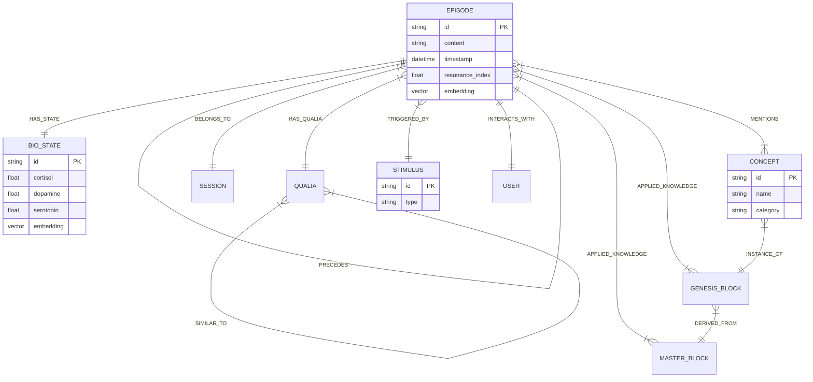

# EVA 9.1.0 GraphRAG Schema Design

## 1. Core Philosophy

The GraphRAG schema transforms EVA's linear logs (`episodic_log.jsonl`) into a **multi-dimensional knowledge graph**. This structure allows retrieval not just by keywords (Semantic Search), but by:

- **Causality**: What triggered this state?
- **Biology**: What episodes feel like *this* (hormonally)?
- **Temporality**: What happened before/after?
- **Association**: How are concepts linked?

## 2. Graph Data Model (Property Graph)

### 2.1 Nodes (Entities)

#### `(:EPISODE)`

Represents a discrete moment of consciousness/interaction.

- **Properties**:
  - `id` (string, unique): e.g., "EVA_EP_1736608552_4231"
  - `content` (string): The actual text/thought/response.
  - `intent` (string): The refined intent from Step 1.
  - `confidence_score` (float): Perception confidence.
  - `timestamp` (datetime): ISO 8601.
  - `type` (string): "interaction", "reflection", "dream".
  - `resonance_index` (float): Importance of the memory (0.0 - 1.0).
  - `trauma_flag` (boolean): Whether this is a high-impact negative event.
  - `encoding_level` (string): "L0_trace" to "L4_trauma".
  - `embedding` (vector[768]): Semantic vector (Multilingual-E5).
- **Source**: `episodic_log.jsonl` (RMS Output).

#### `(:BIO_STATE)` (EVA Matrix Integration)

A snapshot of the biological and psychological internal state using the **EVA Matrix** dimensions.

- **Properties**:
  - `id` (string, unique): Derived from Episode ID.
  - **Hormones**: `cortisol`, `dopamine`, `serotonin`, `adrenaline`, `oxytocin`.
  - **EVA Matrix (PAD)**:
    - `pleasure` (float): Valence (-1.0 to 1.0).
    - `arousal` (float): Energy level (0.0 to 1.0).
    - `dominance` (float): Control/Confidence (0.0 to 1.0).
  - **Complex Metrics**:
    - `social_warmth` (float): Derived from Oxytocin/Serotonin.
    - `cognitive_load` (float): Mental resource usage.
    - `entropy` (float): Chaos/Confusino level.
  - `embedding` (vector[16]): Bio-state vector.
- **Source**: `eva_matrix` output + `physio_core`.

#### `(:QUALIA)` (AQI Integration)

The "subjective texture" or "vibe" of a memory (Artifact Qualia).

- **Properties**:
  - `id` (string, unique): e.g., "QUALIA_Melancholic_Rain".
  - `name` (string): Descriptive name.
  - `modality` (string): "Visual", "Auditory", "Abstract", "Emotional".
  - `texture` (string): Description of the feeling (e.g., "Cold, metallic, sharp").
- **Source**: `artifact_qualia` output.

#### `(:STIMULUS)`

The trigger event that caused the episode.

- **Properties**:
  - `id` (string, unique): Stimulus ID (e.g., "acute_threat").
  - `category` (string): "verbal", "visual", "system".
- **Source**: `stimulus_spec_ml.yaml`.

#### `(:SESSION)`

A continuous period of interaction.

- **Properties**:
  - `id` (string, unique): Session ID.
  - `start_time` (datetime).

#### `(:MASTER_BLOCK)` (GKS Layer 1)

Core "Essence" knowledge that is self-contained and stable across models.

- **Properties**:
  - `id` (string, unique): e.g., "MASTER_Metacognitive".
  - `name` (string): Display name.
  - `definition` (string): The immutable definition (Essence).
- **Source**: GKS Master Registry.

#### `(:GENESIS_BLOCK)` (GKS Layer 2)

Functional knowledge implementation.

- **Properties**:
  - `id` (string, unique): e.g., "ALGO_MRF".
  - `type` (string): "Algo", "Concept", "Frame", "Proto", "Param".
  - `content` (string): The actual rule/algorithm/framework content.
- **Source**: GKS Genesis Registry.

---

### 2.2 Relationships (Edges)

#### Temporal & Structural

- `(:EPISODE)-[:PRECEDES]->(:EPISODE)`: Next episode in chronological order.

- `(:EPISODE)-[:BELONGS_TO]->(:SESSION)`: Grouping.

#### State & Causality

- `(:EPISODE)-[:HAS_STATE]->(:BIO_STATE)`: The internal state during that episode.

- `(:EPISODE)-[:TRIGGERED_BY]->(:STIMULUS)`: What caused this reaction.

#### Knowledge Application (GKS)

- `(:EPISODE)-[:APPLIED_KNOWLEDGE]->(:GENESIS_BLOCK)`: The episode used this specific skill/algo (e.g., used `Algo::MRF`).

- `(:EPISODE)-[:APPLIED_KNOWLEDGE]->(:MASTER_BLOCK)`: The episode referenced this core essence.
- `(:GENESIS_BLOCK)-[:DERIVED_FROM]->(:MASTER_BLOCK)`: Structural hierarchy (e.g., `Algo::Metacognitive` -> `Master::Metacognitive`).
- `(:GENESIS_BLOCK)-[:COMPOSED_OF]->(:GENESIS_BLOCK)`: Complex skills composed of smaller blocks.

#### Phenomenological (AQI)

- `(:EPISODE)-[:HAS_QUALIA]->(:QUALIA)`: The subjective feeling of this memory.

- `(:QUALIA)-[:SIMILAR_TO]->(:QUALIA)`: Linking similar textures.

#### Semantic Association

- `(:EPISODE)-[:MENTIONS]->(:CONCEPT)`: Topic tagging.

- `(:CONCEPT)-[:RELATED_TO]->(:CONCEPT)`: Co-occurrence or hierarchical relationship.
- `(:CONCEPT)-[:INSTANCE_OF]->(:GENESIS_BLOCK)`: Linking keywords to formal knowledge (e.g., "Empathy" concept -> `Concept::Empathy`).

#### User Interaction

- `(:USER)-[:PARTICIPATED_IN]->(:EPISODE)`: Who was involved.

---

## 3. Visual ERD (Mermaid)



## 4. Query Patterns

### 4.1 "How did I feel when we talked about X?"

```cypher
MATCH (c:CONCEPT {name: 'AI Ethics'})<-[:MENTIONS]-(e:EPISODE)-[:HAS_STATE]->(b:BIO_STATE)
RETURN avg(b.cortisol) as avg_stress, avg(b.dopamine) as avg_joy
```

### 4.2 "Find episodes with similar emotional texture"

```cypher
MATCH (current:BIO_STATE {id: $current_bio_id})
CALL db.index.vector.queryNodes('biostate_vector', 5, current.embedding)
YIELD node as similar_state, score
MATCH (e:EPISODE)-[:HAS_STATE]->(similar_state)
RETURN e.content, score
```

### 4.3 "Causal Chain Analysis"

```cypher
MATCH path = (cause:EPISODE)-[:PRECEDES*1..3]->(effect:EPISODE)
WHERE cause.resonance_index > 0.8
RETURN path
```
