# Unified 3-Phase + Gap Orchestration Flow (v9.4.0)

This diagram visualizes the synchronized interaction between the Single-Inference LLM session, the Physiological Gap, and the 4-Layer Resonance Engine.

```mermaid
sequenceDiagram
    participant User
    participant Gateway as SLM (Cognitive Gateway)
    participant LLM_P1 as LLM (Phase 1: Perception)
    participant ResEng as Resonance Engine (L1-L4)
    participant Gap as The Gap (Physio + Matrix + RAG)
    participant LLM_P2 as LLM (Phase 2: Reasoning)
    participant MSP as MSP (Persistence Layer)

    User->>Gateway: [STIMULUS] Input Text
    Gateway-->>Gateway: Extract Intent & Paradox Signal
    Gateway->>ResEng: L1-L2 Analysis (Literal & Interpretive)
    ResEng-->>ResEng: MRF + APM (Archetype Projection)
    
    rect rgb(30, 30, 45)
        Note over LLM_P1: PHASE 1: PERCEPTION
        LLM_P1->>Gateway: [TOOL] sync_biocognitive_state()
        LLM_P1-->>MSP: [PARTIAL WRITE] User Fragment latch
    end

    rect rgb(45, 30, 30)
        Note over Gap: THE GAP (Parallel Processing)
        par Physiology
            Gap->>Gap: 30Hz Endocrine Update (HPA/Circadian)
        and Psyche
            Gap->>Gap: 9D Matrix State Drift
        and Retrieval
            Gap->>Gap: 7-Stream Agentic RAG (Recall)
        end
    end

    rect rgb(30, 45, 30)
        Note over LLM_P2: PHASE 2: REASONING & PROPOSAL
        Gap->>LLM_P2: Deep State Injection (Body + Memory)
        LLM_P2->>LLM_P2: Embodied Reflection & Response
        LLM_P2->>MSP: [TOOL] propose_episodic_memory()
    end

    rect rgb(40, 40, 60)
        Note over MSP: STEP 4: ARCHIVAL & HYDRATION
        MSP->>ResEng: L3-L4 Analysis (Resonant & Transcendent)
        ResEng-->>MSP: RI Score + Umbrella Deployment Status
        MSP->>MSP: Final Episode Consolidation & Indexing
    end
    
    MSP-->>User: [RESPONSE] Expressive & Embodied Output
```

