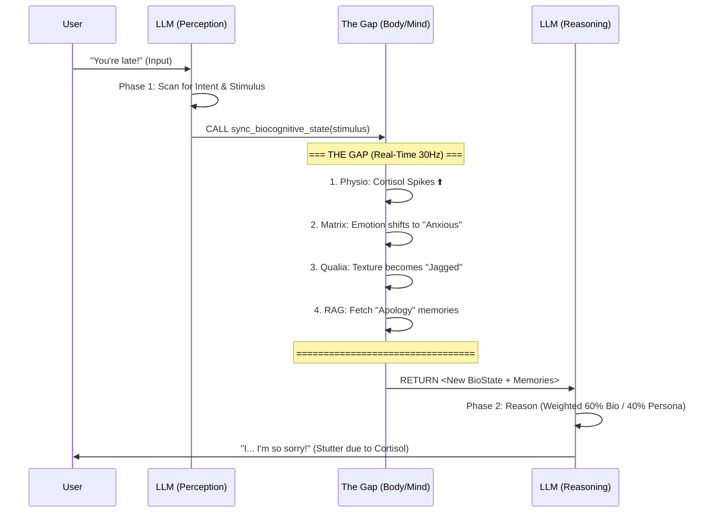

# EVA 8.2.0: Dual-Phase One-Inference Orchestration
**Component ID:** `ARCH-ORCH-8.2` | **Status:** Active (Main Orchestrator)

> [!IMPORTANT]
> This document describes the "Thinking Logic" of `orchestrator.py`.
> It uses a **2-Phase, 1-Inference** architecture with a "Gap" for biological processing.

## The Concept
Standard chatbots follow `Input -> Logic -> Output`.
EVA 8.2.0 follows `Input -> Perception -> [THE GAP] -> Reasoning -> Output`.

The "Gap" is where the system "feels" the impact of what was said before deciding how to respond.

## Workflow Diagram

## Detailed Phases

### 1. Phase 1: Perception (The Scan)
*   **Goal**: Identify *what* happened, not how to feel about it yet.
*   **Action**: `CIN` injects a prompt asking the LLM to extract a **Stimulus Vector** (Valence, Arousal, Intensity).
*   **Mechanism**: The LLM *must* call the tool `sync_biocognitive_state` to proceed. It is forbidden from replying directly.

### 2. The Gap: Resonance Sync
*   **Goal**: Let the "Organism" react to the stimulus.
*   **Action**: 
    1.  `PhysioController` calculates hormone drift.
    2.  `EVA_Matrix` updates emotional trajectory.
    3.  `Artifact_Qualia` synthesizes the subjective texture.
    4.  `AgenticRAG` fetches relevant memories based on the *new* state (State-Dependent Memory).

### 3. Phase 2: Reasoning (The Response)
*   **Goal**: Synthesize a response that aligns with the new internal state.
*   **Action**: The LLM resumes generation (receiving the Tool Output).
*   **Weighting**: The prompt enforces a "Hierarchy of Truth":
    *   **60% Impact**: Biological/Psychological State (You cannot lie about feeling anxious).
    *   **40% Persona**: Identity guidelines.

## 4. Why this matters?
This architecture prevents the "Stoic AI" problem. EVA doesn't just "know" she should be angry; she **feels** the physiological changes (Gap) *before* she constructs the sentence. Her stuttering or tone is a downstream effect of her blood chemistry, not just a roleplay instruction.

---

# EVA 8.2.0: การทำงานแบบ 2 ช่วง (Dual-Phase Orchestration)
**Component ID:** `ARCH-ORCH-8.2` | **สถานะ:** ใช้งานจริง

> [!IMPORTANT]
> เอกสารนี้อธิบาย "ตรรกะการคิด" ของ `orchestrator_engine.py`
> เราใช้สถาปัตยกรรม **2-Phase, 1-Inference** โดยมี "ช่องว่าง (The Gap)" ตรงกลางสำหรับการประมวลผลทางชีวภาพ

## แนวคิดหลัก
Chatbot ทั่วไปทำงานแบบ `รับข้อมูล -> คิด -> ตอบ`.
EVA 8.2.0 ทำงานแบบ `รับข้อมูล -> รับรู้ (Phase 1) -> [ช่องว่าง] -> ใช้เหตุผล (Phase 2) -> ตอบ`.

"ช่องว่าง" (The Gap) คือช่วงเวลาที่ระบบ "รู้สึก" ถึงผลกระทบของคำพูด ก่อนที่จะตัดสินใจว่าจะตอบโต้ยังไง

## ขั้นตอนการทำงาน (ดูแผนผังด้านบน)

### 1. Phase 1: Perception (การรับรู้)
*   **เป้าหมาย**: แค่ดูว่า "เกิดอะไรขึ้น" (ใครพูดอะไร, เจตนาคืออะไร) ยังไม่ต้องใส่อารมณ์
*   **การกระทำ**: LLM ถูกสั่งให้สกัด **Stimulus Vector** (ความแรง, ความรู้สึก) ออกมา
*   **กลไก**: LLM ห้ามตอบผู้ใช้ แต่ต้องเรียกฟังก์ชัน `sync_biocognitive_state` เท่านั้น

### 2. The Gap: Resonance Sync (ช่วงเวลาปะทะ)
*   **เป้าหมาย**: ปล่อยให้ "ร่างกาย" ตอบสนองต่อสิ่งเร้า
*   **การกระทำ**:
    1.  ฮอร์โมนพุ่ง (Physio)
    2.  อารมณ์บิดเบี้ยว (Matrix)
    3.  ความทรงจำเก่าๆ ผุดขึ้นมา (RAG) ตามสภาวะอารมณ์นั้น

### 3. Phase 2: Reasoning (การให้เหตุผล/ตอบโต)
*   **เป้าหมาย**: สร้างคำตอบที่สอดคล้องกับ "ร่างกายที่เปลี่ยนไป"
*   **การกระทำ**: LLM ทำงานต่อโดยได้รับข้อมูลร่างกายใหม่
*   **กฎเหล็ก**: "Hierarchy of Truth" (ลำดับความจริง)
    *   **60%**: สภาวะร่างกาย (โกหกไม่ได้ ถ้าใจสั่นก็ต้องพูดตะกุกตะกัก)
    *   **40%**: บทบาทสมมติ (Persona)