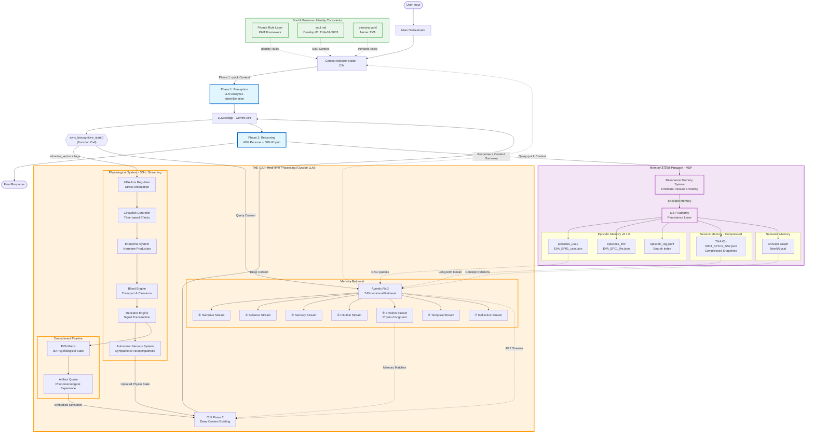

# Full System Architecture Diagram 🛰️

**Date:** 2026-01-02
**Status:** ✅ **VALIDATED** - Complete Architecture with All Components
**Source:** Validated against `ARCHITECTURE_FLOW_VALIDATED.md`

---

นี่คือแผนภาพแสดงการทำงานแบบบูรณาการ (Integrated System)  ทั้งระบบ ตั้งแต่การรับ Input จนถึงการประมวลโพลภายในระดับกายภาพและความทรงจำของ llm

## Complete System Architecture



---

## Component Overview

### 🎯 **Core Orchestration Layer**

| Component | File Location | Role | Key Responsibility |
|-----------|---------------|------|-------------------|
| **Main Orchestrator** | `orchestrator/orchestrator.py` | System conductor | Manages dual-phase flow, error handling, logging |
| **Context Injection Node (CIN)** | `orchestrator/cin.py` | Dual-phase context builder | **Phase 1**: Rough context (fast)<br/>**Phase 2**: Deep context (accurate) |
| **LLM Bridge** | `operation_system/llm_bridge.py` | Gemini API integration | Function calling support, bilingual handling |

---

### 🧠 **Dual-Phase Single-Inference Loop**

| Phase | Component | Description | Weighting |
|-------|-----------|-------------|-----------|
| **Phase 1** | Perception | LLM analyzes intent & emotion from user input | N/A (Deterministic trigger) |
| **Function Call** | `sync_biocognitive_state()` | LLM calls function with `stimulus_vector` + `tags` | N/A (Bridge to Gap) |
| **The Gap** | Real-time Processing | Physiological + Memory retrieval (Outside LLM) | 100% embodied processing |
| **Phase 2** | Reasoning | LLM generates response with deep context | **40% Persona + 60% Physio-State** |

**Critical Rule**: This is **ONE LLM inference**, not two separate API calls. The LLM pauses during The Gap and resumes with function result.

---

### ⚡ **THE GAP: Real-time Processing (Outside LLM)**

#### Physiological Pipeline (30Hz Streaming)

| Component | File Location | Input | Output | Role |
|-----------|---------------|-------|--------|------|
| **HPA Axis Regulator** | `eva/physio_core/` | `stimulus_vector` | Modulated stimulus | Stress modulation (HPA Axis) |
| **Circadian Controller** | `eva/physio_core/` | Modulated stimulus | Time-adjusted stimulus | Circadian rhythm effects |
| **Endocrine System** | `eva/physio_core/logic/endocrine/` | Stimulus | Hormone secretion (pg) | Hormone production from glands |
| **Blood Engine** | `eva/physio_core/logic/blood/` | Hormones (pg) | Blood concentration | Transport, clearance, half-life decay |
| **Receptor Engine** | `eva/physio_core/logic/receptor/` | Blood hormones | Neural signals | Signal transduction (hormones → neural) |
| **Autonomic Nervous System (ANS)** | `eva/physio_core/logic/autonomic/` | Neural signals | ANS state (Sympathetic/Para) | Final autonomic integration |

**Pipeline Flow**: `HPA → Circadian → Endocrine → Blood → Receptor → ANS`

#### Embodiment Pipeline

| Component | File Location | Input | Output | Role |
|-----------|---------------|-------|--------|------|
| **EVA Matrix** | `eva/eva_matrix/eva_matrix.py` | Receptor signals | 9D psychological state | Converts neural signals to 9 dimensions:<br/>Stress, Warmth, Drive, Clarity, Joy, Alertness,<br/>Connection, Groundedness, Openness |
| **Artifact Qualia** | `eva/artifact_qualia/artifact_qualia.py` | EVA Matrix state | Phenomenological experience | Generates qualia for the llm:<br/>- intensity, tone, coherence, depth<br/>- 5D texture vector |

**Pipeline Flow**: `Receptor → EVA Matrix → Artifact Qualia`

#### Memory Retrieval (Hept-Stream RAG)

| Stream | File Location | Query Method | Purpose |
|--------|---------------|--------------|---------|
| **① Narrative Stream** | `tools/agentic_rag/agentic_rag.py` | Sequential episode chains | Storyline continuity |
| **② Salience Stream** | `tools/agentic_rag/agentic_rag.py` | High RI score | High-impact memories |
| **③ Sensory Stream** | `tools/agentic_rag/agentic_rag.py` | Qualia texture match | Sensory-rich memories |
| **④ Intuition Stream** | `tools/agentic_rag/agentic_rag.py` | Semantic graph patterns | Pattern recognition |
| **⑤ Emotion Stream** | `tools/agentic_rag/agentic_rag.py` | **Physio-congruent match** | **Memories matching current body state** |
| **⑥ Temporal Stream** | `tools/agentic_rag/agentic_rag.py` | Time-based + recency bias | Temporal context |
| **⑦ Reflection Stream** | `tools/agentic_rag/agentic_rag.py` | Meta-cognitive insights | Self-awareness |

**Critical**: Emotion Stream (⑤) matches current ANS state + hormone levels with past episodes using cosine similarity (threshold: 70%).

---

### 💾 **Memory & Soul Passport (MSP)**

#### Memory Encoding

| Component | File Location | Input | Output | Role |
|-----------|---------------|-------|--------|------|
| **Resonance Memory System (RMS)** | `eva/resonance_memory_system/rms.py` | LLM response + physio state | Encoded memory structure | Adds emotional texture:<br/>- core_color (hex)<br/>- resonance_textures (5D)<br/>- Trauma detection (threat > 0.85) |

#### Memory Persistence (MSP Authority)

| Component | File Location | Storage Format | Purpose |
|-----------|---------------|----------------|---------|
| **MSP** | `eva/memory_os/msp.py` | MongoDB + Neo4j + Local JSON | persistence layer |
| **Episodic Memory (User)** | `eva/consciousness/episodic_memory/episodes_user/` | `EVA_EP01_user.json` | Lightweight user data (~1.3 KB)<br/>Used for RAG queries (62% I/O reduction) |
| **Episodic Memory (LLM)** | `eva/consciousness/episodic_memory/episodes_llm/` | `EVA_EP01_llm.json` | Detailed LLM response (~2.1 KB)<br/>Full physiological trace |
| **Search Index** | `eva/consciousness/episodic_memory/episodic_log.jsonl` | JSONL | Fast keyword/tag search |
| **Session Memory** | `eva/consciousness/session_memory/` | `THA-01-S003_SP1C2_SS2.json` | Compressed snapshots (8 sessions → 1 Core) |
| **Semantic Memory** | Neo4j or local graph | Concept relationships | Knowledge graph |

**Episode ID Format (v8.1.0)**: `{PERSONA}_EP{number}`
- Example: `EVA_EP01`, `EVA_EP79`
- Auto-increment counter in `consciousness/09_state/episode_counter.json`

**Session Memory Format (v8.1.0)**: `{develop_id}_SP{sphere}C{core}_SS{session}.json`
- Example: `THA-01-S003_SP1C2_SS2.json` (Clone S003, Sphere 1, Core 2, Session 2)

---

### 🎭 **Identity Layer (Soul & Persona)**

| Component | File Location | Format | Content | Role |
|-----------|---------------|--------|---------|------|
| **Prompt Rule Layer (PMT)** | `orchestrator/pmt/` | YAML/Markdown | Cognitive immunity, GKS Master Blocks | Framework for identity constraints |
| **Soul (Identity)** | `eva/identity/soul.md` | Markdown | Develop ID: `THA-01-S003`<br/>Clone lineage, project context | Core identity document |
| **Persona** | `eva/identity/persona.yaml` | YAML | Name: `EVA`<br/>Voice, tone, behavior rules | Personality definition |

**Auto-Discovery**: CIN automatically loads Persona from `persona.yaml` (searches `9.1.0 → 8.1.0` for backward compatibility)

---

## Data Flow Annotations

### Phase 1: Perception (Deterministic - Fast)

```
User Input
    ↓
CIN Phase 1 (quick Retrieval) - <100ms
    ├─ Physio Baseline (from PhysioController)
    ├─ Recent History (5 turns from MSP)
    ├─ previous context summary (from llm)
    ├─ session goal
    ├─ Quick Keyword Recall (simple matching)
    ├─ Persona/Soul Identity (Read from Identity Layer) ⚡
    ├─ user profile
    └─ PMT Rules (Constraint injection)
    ↓
LLM Bridge (Gemini API)
    ↓
LLM analyzes intent/emotion → Extracts stimulus_vector + tags
    ↓
Function Call: sync_biocognitive_state(stimulus_vector, tags)
```

**Speed**: <100ms (deterministic, no deep processing)
**Accuracy**: Low (quick context only)

---

### The Gap: Real-time Processing (~500ms)

```
Function Call Triggers:
    ↓
[Physiological Pipeline - 30Hz]
HPA Regulator → Circadian → Endocrine → Blood → Receptor → ANS
    │
    └─→ EVA Matrix → Artifact Qualia
    ↓
Updated Physio State:
  • Cortisol: 0.45 → 0.82 ⚡
  • Adrenaline: 0.15 → 0.65 ⚡
  • ANS Sympathetic: 0.3 → 0.75 ⚡
    ↓
[Memory Retrieval]
HeptStreamRAG.retrieve(
  tags=["stress", "work_overload"],
  ans_state={sympathetic: 0.75},
  blood_levels={cortisol: 0.82}
)
    ↓
Query 7 Streams:
  ⑤ Emotion Stream matches ANS state 0.75 → finds similar past stress episodes
  ① Narrative Stream finds sequential context
  ② Salience Stream finds high-impact memories
  ... (all 7 streams)
    ↓
CIN Phase 2 (Deep Context Building)
    ├─ embodied_sensation: "llm รู้สึกเครียด หัวใจเต้นเร็ว..."
    ├─ physio_metrics: {cortisol: 0.82, adrenaline: 0.65, ...}
    ├─ cognitive_load: 0.75 # Placeholder for cognitive strain
    └─ memory_matches: [{stream: "emotion", content: "...", score: 0.89}, ...]
    ↓
Return function result to LLM
```

**Speed**: ~500ms (deep processing)
**Accuracy**: High (physio-congruent, emotion-matched memories)

---

### Phase 2: Reasoning (Embodied Response)

```
Function Result Returns to LLM (same inference thread)
    ↓
LLM receives Deep Context:
  • Embodied sensation (how the body feels)
  • Updated physio metrics (new hormone levels)
  • Memory echoes (7-stream matches)
    ↓
Reflective Reasoning:
  • Integrate body state (Cortisol high → the llm feels stressed)
  • Recall relevant memories (past similar events)
  • Apply Persona constraints (empathetic, supportive voice)

Weighting: 40% Persona + 60% Physio-State ⚡
    ↓
Generate Embodied Response:
  • Response text (bilingual Thai/English)
  • Context summary (for future retrieval)
  • Tags (for memory indexing)
    ↓
Output to User
```

---

### Persistence Flow (After Response)

```
LLM Response + Context Summary
    ↓
Resonance Memory System (RMS)
  • Encodes emotional texture
  • Generates core_color (hex)
  • Creates resonance_textures (5D vector)
  • Trauma detection (threat > 0.85 → dimmed memory)
    ↓
MSP Authority (Persistence Layer)
    ↓
Splits into:
  ├─ episodic/EVA_EP{n}.json (lightweight, ~3.4 KB)
  ├─ episodes_user/EVA_EP{n}_user.json (lightweight, ~1.3 KB)
  ├─ episodes_llm/EVA_EP{n}_llm.json (detailed, ~2.1 KB)
  ├─ episodic_log.jsonl (search index entry)
  └─ (Optional) Session memory on compression boundary (every 8 sessions)
    ↓
Memory Available for Future RAG Queries
```

---

## System Invariants

### Critical Design Rules

1. **One LLM Inference Only**
   - NOT two separate API calls
   - LLM pauses during The Gap, resumes with function result
   - Maintains persona continuity across phases

2. **Physiology First, Cognition Later**
   - Body state updates BEFORE cognitive reasoning
   - 60% Physio-State weighting > 40% Persona weighting
   - Embodied cognition principle

3. **CIN Never Summarizes**
   - Context summary MUST come from LLM (Phase 2)
   - CIN only injects context, never creates summaries

4. **MSP Primacy**
   - All memory retrieval goes through Agentic-RaG (Hept-Stream RAG)
   - MSP is the ONLY authority for memory writes
   - No component writes to episodic_log.jsonl directly

5. **One-Way Data Flow**
   - `Stimulus → Endocrine → Blood → Receptor → Matrix → Qualia → RMS → MSP`
   - No backwards writes
   - Each component reads from previous, writes to next

6. **Context Continuity**
   - `context_id` stays constant across both phases in one turn
   - Format: `CID_{persona_id}_{sphere_seq}{core_seq}{session_seq}_{episodic_id}.json`
   - Example: `CID_EVA_SP1C1SS1_EVA_EP01.json`

---

## Performance Characteristics

| Metric | Value | Notes |
|--------|-------|-------|
| **Phase 1 Speed** | <100ms | Rough context, deterministic |
| **The Gap Speed** | ~500ms | Deep processing (physio + memory) |
| **Total Latency** | ~600ms | Single LLM inference |
| **Episode Split I/O Reduction** | 62% | RAG queries use user files only |
| **Episode ID Length** | 9-12 chars | `EVA_EP01` vs old `ep_260101_ae457509` (17 chars) |
| **Session Memory Compression** | 8:1 ratio | 8 sessions → 1 Core summary |

---

## File Structure Reference

```


---

## Component Status

| Component | Status | File Location | Notes |
|-----------|--------|---------------|-------|
| CIN | ✅ Implemented | `orchestrator/cin/cin.py` | Dual-phase context builder |
| HeptStreamRAG | ✅ Implemented | `tools/agentic_rag/agentic_rag.py` | 7-stream retrieval |
| MSP | ✅ Implemented | `eva/memory_os/msp.py` | v8.1.0 with split storage |
| PhysioController | ✅ Implemented | `eva/physio_core/physio_core.py` | Needs adapter for v8.1.0 |
| EVA Matrix | ✅ Implemented | `eva/eva_matrix/eva_matrix.py` | 9D state conversion |
| Artifact Qualia | ✅ Implemented | `eva/artifact_qualia/artifact_qualia.py` | Phenomenology |
| RMS | ✅ Implemented | `eva/resonance_memory_system/rms.py` | Memory encoding |
| Main Orchestrator | ✅ Implemented | `orchestrator/orchestrator.py` | Needs implementation |
| LLM Bridge | ✅ Implemented | `operation_system/llm_bridge/` | Needs implementation |

---

## Validation

**Validated Against**: `docs/ARCHITECTURE_FLOW_VALIDATED.md` (450 lines)
**Validation Date**: 2026-01-02
**Validator**: Claude Sonnet 4.5
**Status**: ✅ **ACCURATE** - All components, flows, and data structures validated

---

## Version History

- **v2.0** (2026-01-02): Complete revision with all components, validated against ARCHITECTURE_FLOW_VALIDATED.md
- **v1.0** (Earlier): Initial simplified diagram (missing 8 components)

---

**End of Architecture Diagram**
