# Bio-Digital Gap Orchestration Flow (EVA 9.1.0)

> [!CAUTION]
> **CRITICAL IMPLEMENTATION RULE**
>
> This flow MUST be implemented using **1 LLM Session** (Sequential Function Calling), NOT 3 separate LLM calls.
>
> **Correct Pattern:**
>
> ```mermaid
> LLM: sync_biocognitive_state() → Gap Execution → LLM: continue_with_result()
> ```
>
> **See:** `docs/CRITICAL_PRINCIPLES.md` for detailed implementation guide.
>
> Violating this principle breaks EVA's embodied response mechanism.

This document outlines the "System-Propelled Hydration" and "Bio-Digital Gap" workflow, simulating a human-like pause for biological and cognitive processing between perception and response.

## 🌊 The Flow Overview

### 1. Phase 1: Perception (First Impression)

- **Input:**
  - **Live Physio Snapshot:** Immediate biological state.
  - **User Text:** Raw input.
- **Cognitive Gateway (SLM):**
  - **Model:** Llama-3.2-1B (System 1).
  - **Action:** Rapidly extracts Intent and Emotional Signal.
  - **Salience Anchor:** Identifies the specific phrase triggering the reaction.
- **System Action (Pre-Inference):**
  - **Initial RIM Calculation:** Using `RIMCalculator` to map SLM signals to base impact.
- **AI Action (Gemini):**
  - **Refined Perception:** Receives SLM data as "Intuitive Gut Feeling."
  - **Resonance Confidence:** Gemini evaluates the alignment between its reasoning and the SLM's instinct.
  - **Tool:** `SYNC_BIOCOGNITIVE_STATE_TOOL` with `confidence_score`.
  - **Partial Write:** Buffers the `turn_user` fragment (Raw Text + Initial RIM) to memory instantly.

### 2. The Gap: Parallel Processing

- **Process A (Body)**: `Physio Core` chunking + **30Hz Continuous Loop**. Hormones exhibit pure exponential decay toward zero, balanced by **Basal Secretion**.
- **Vitals Integration**: Heart Rate (BPM) and Respiration (RPM) are calculated in the backend (`VitalsEngine`). RPM drives **Vagus Tone**, which provides negative feedback to inhibit stress hormone production during the gap.
- **Process B (Memory - Two-Stage)**:
  - **Stage 1 (Quick Recall):** Runs parallel with Physio. Retrieves Narrative (20%), Intuition (5%), Reflection (5%) streams using only semantic tags.
  - **Stage 2 (Deep Recall):** After bio state ready. Retrieves Emotion (35%), Salience (15%), Sensory (10%), Temporal (10%) streams using full biological state.
  - **Merge:** Deduplicate and re-rank by weighted scores.
- **Result:** A new "Deep State" that blends physiological reaction with retrieved history.

### 3. Phase 2: Reasoning & Proposal

- **Context Injection:** AI receives the "Deep State":
  - **Body:** Full Physio Snapshot + EmotiveHash (H9/H5 Compressed History).
  - **Memory:** Retrieved RAG Fragments.
  - **Qualia:** Phenomenological texture.
- **AI Action:** Generates response and uses `PROPOSE_EPISODIC_MEMORY_TOOL`.
  - **AI Proposal:** Narrative Summary, Interpretive Context, and Draft Fragments.

### 4. Hydration & Persistence (System Authority)

The Orchestrator "hydrates" the AI's proposal with authoritative data before saving.

#### A. User Hydration (Re-Evaluation)

- **Deep RIM:** System calculates new resonance against the final "Deep State".
- **RIM Diff:** Calculates change in impact: `Diff = Deep RIM - Initial RIM`.
  - *Example:* Initial excitement (0.8) -> Recall raises caution -> Deep RIM (0.5) = Diff (-0.3).

#### B. AI Hydration (Self-Measurement)

- **AI RIM:** Calculated from `AI Confidence` (Internal) + `System Impact` (Bio-Feedback).
  - Formula: `(Confidence * Epistemic_Weight * 0.4) + (Bio_Impact * 0.6)`

#### C. Final Resonance (The Episode State)

- **Final RI:** Weighted blend of Biological Impact (60%) and AI Cognitive Resonance (40%).
- **Archival:** The fully hydrated, data-rich episode is written to `MSP` as a verifiable memory record.

### 5. Phase 3: Autonomic Prediction (Closing the Loop)

- **AI Action:** After generating the response, the AI performs a "Next-Step" prediction.
- **Goal:** Anticipate user needs, future conversational intent, and potential system adjustments.
- **Context Persistence:**
  - **Implicit Intent:** AI identifies what the user *might* ask next.
  - **Emotional Trajectory:** Predicts how hormones will likely shift in the next turn.
- **Result:** These predictions are buffered as `context_id` metadata, which becomes the **Input for Phase 1** of the next conversational turn.

- **Result:** These predictions are buffered as `context_id` metadata, which becomes the **Input for Phase 1** of the next conversational turn.

## 6. Context Safety & Optimization (Overflow Prevention)

To prevent "Context Hallucination" and overflow errors, the flow enforces strict bounding:

### A. The 5-Turn Rolling Window

- **Mechanism:** `CIM.update_turn_state()` strictly slices history to the last 5 interactions.
- **Safety:** Old turns are moved to **Archival Memory (MSP)** and accessed *only* via RAG.
- **Result:** Phase 1 context is capped at **5000 tokens** (History) to ensure focused continuity.

### B. EmotiveHash Compression

- **Mechanism:** 9D Matrix history is compressed into `H9` or `H5` hashes (e.g., `H1-0.95-S800W200...`).
- **Safety:** Allows the LLM to "feel" the emotional arc of 50+ turns without raw text dump.
- **Result:** Emotional continuity uses <50 tokens instead of 5000+.

### C. Token Budget Enforcement

- **Phase 1 Budget:** Max **8000 Tokens** (High Fidelity).
  - Identity: 500
  - History (5-turn): 5000
  - Baselines: 200
- **Verification:** CIM uses `tiktoken` to pre-count and truncate *before* LLM injection.

---

## ⚙️ Runtime & Configuration

### Standardized Interface

All core modules (Orchestrator, CIM, MSP) now adhere to a unified `_Interface.yaml` standard, defining:

- **Runtime Hook:** System loader entry point (e.g., `orchestrator.orchestrator.EVAOrchestrator`).
- **Bus Bindings:** Publisher/Subscriber roles.

### Operational Modes

1. **Orchestrator (Main Loop):** Controls the central clock (`tick_rate: user_driven`) and session timeouts.
2. **CIM (Event-Driven):** Triggered by the Orchestrator in 3 explicit phases (Phase 1 -> Gap -> Phase 2 -> Phase 3).

## 📊 Visual Sequence Diagram

```mermaid
sequenceDiagram
    participant User
    participant SLM as Cognitive Gateway (SLM)
    participant LLM_P1 as LLM (Phase 1)
    participant System as Orchestrator/System
    participant Physio as Physio Core
    participant Memory as RAG/RMS
    participant LLM_P2 as LLM (Phase 2)
    participant MSP

    User->>System: Input Text
    System->>SLM: Extract Intent & Anchor (Llama-3.2-1B)
    SLM-->>System: Intent + Signal + Anchor
    System->>System: Calc Initial RIM (Instinctual Impact)
    System->>Physio: Get Live Snapshot
    System->>LLM_P1: Phase 1 Prompt (Context + Live Physio + SLM Instinct)
    LLM_P1->>System: Tool: sync_biocognitive_state (Stimulus + Salience Anchor + Confidence)
    
    rect rgb(30, 30, 50)
        note right of System: 🧠 PERCEPTION & PARTIAL WRITE (First Impression)
        System->>System: Calc Initial RIM (Immediate Arousal)
        System->>System: Buffer Partial User Fragment
    end

    rect rgb(50, 20, 40)
        note right of System: ⚡ THE GAP (Parallel Processing)
        par Physio Chunking
            System->>Physio: Process Stimulus (dt=60s)
            Physio->>System: Updated Hormones & Matrix
        and Context Retrieval
            System->>Memory: Agentic RAG (Hept-Stream)
            System->>Memory: RMS (Color Match)
            Memory->>System: Retrieved Contexts
        end
        System->>System: Aggregate "Deep State" (Body + Memory)
    end

    System->>LLM_P2: Phase 2 Prompt (Deep State + Memory)
    LLM_P2->>System: Response + Tool: propose_episodic_memory

    rect rgb(20, 50, 30)
        note right of System: 💧 SYSTEM-PROPELLED HYDRATION
        System->>System: Calc Deep RIM (Deep State Impact)
        System->>System: Calc RIM Diff (Deep - Initial)
        System->>System: Calc AI RIM (Confidence * 0.4 + Bio * 0.6)
        System->>System: Calc Final RI (Bio * 0.6 + AI * 0.4)
        System->>System: Hydrate & Merge Fragments
    end

    System->>MSP: Write Verified Episode

    rect rgb(30, 50, 60)
        note right of System: 🛰️ PHASE 3: AUTONOMIC PREDICTION
        System->>LLM_P2: Phase 3 (Future Intent & Intent Plan)
        LLM_P2->>System: Next-Turn Prediction & Implicit Intent
        System->>System: Buffer for next Phase 1 Context
    end
```


