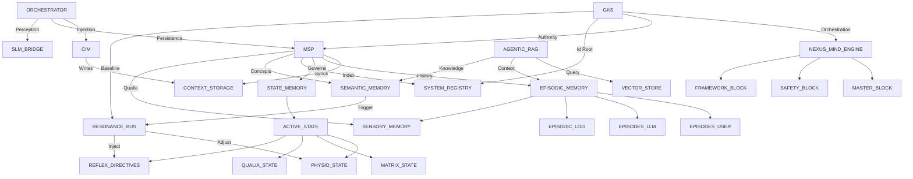

# EVA 9.2.0 System Storage & Entity Relationships (ERD)

This document provides a formal mapping of EVA 9.2.0's data architecture, focusing on how different modules interact with the various storage layers within the `consciousness/` and `memory/` hierarchies.

## 1. Core Architecture Diagram

The following Mermaid diagram illustrates the flow of data and the ownership of specific storage slots.

## 2. Entity Definitions

### 2.1 Orchestrator

The central nervous system that coordinates Phase-1 (Perception) and Phase-2 (Reasoning). It does not own data directly but orchestrates the flow between CIM, MSP, and the LLM.

### 2.2 CIM (Context Injection Module)

Responsible for preparing the LLM's "Working Memory" (Context).

- **Ownership**: `eva/consciousness/context_storage/full_context/`
- **Role**: Maintains high-fidelity turn history to ensure logical continuity.

### 2.3 MSP (Memory & Soul Passport)

The primary governor for all persistent data and system state.

- **Ownership**: `eva/consciousness/` (Root Governance)
- **Role**: Manages the `active_state/` bus, `episodic_memory/` archives, and the `system_registry.json`.

### 2.4 State Memory (Active State Bus)

A transient storage layer for inter-module broadcasting of real-time data.

- **Path**: `eva/consciousness/state_memory/active_state/`
- **Slots**:
  - `physio_state.json`: Heart Rate, Breathing, Hormone levels.
  - `matrix_state.json`: 9D Emotional axes.
  - `qualia_state.json`: Subjective depth, intensity, and tone.

### 2.5 Episodic Memory

The permanent record of the system's "lived experience".

- **Path**: `eva/consciousness/episodic_memory/`
- **Structure**: Split into `episodes_user/` and `episodes_llm/` to preserve data lineage and developer identity (`THA-06`).

### 2.6 Semantic Memory

The conceptual knowledge base of the system.

- **Path**: `eva/consciousness/semantic_memory/`
- **Role**: Stores abstracted concepts, persistent relationships, and structural patterns identified across multiple sessions.

### 2.7 Sensory Memory (Sidecars)

Rich phenomenological detail attached to specific episodes.

- **Path**: `eva/consciousness/sensory_memory/`
- **Role**: Acts as a "Sidecar" for episodic memory, storing high-resolution qualia data that would be too heavy for the main episodic log. Linked via `sensory_id`.

### 2.8 GKS (Genesis Knowledge System)

The "Higher Mind" and architectural anchor of the organism.

- **Path**: `genesis_knowledge_system/`
- **Orchestration**: Managed by the **NexusMind Engine** (`NexusMindEngine.py`).
- **Core Components**:
  - **Master Block**: Distilled canonical logic (Anticipation, Fear Calculation, etc.) used as a high-speed reference.
  - **Safety Block**: Global risk parameters and "Rule 1" (Safety Priority) enforcement.
  - **Framework Block**: Architectural rules that govern how sub-engines (FF, LE, NE, etc.) interact.
- **Role**: Acts as the ultimate validator of "Insecurity" states and provides the "Master View" for the final system synthesis.

## 4. Trigger & Cross-link Logic (Activation Cascade)

Inspired by the V2.0 Prototype, V9.1 implements a **Functional Hierarchy** where semantic concepts act as "Triggers" for behavioral and physiological shifts.

### 4.1 The Sequence (Who Triggers First?)

1. **EXTERNAL INPUT (User)**: The initial stimulus.
2. **SENSORY/PERCEPTION (Gateway)**: Identifies the "Salience Anchor" (e.g., `Logical_Threat`).
3. **SEMANTIC ACTIVATION (The Link)**: The RAG pulls the corresponding Concept (e.g., `Concept::Software_Fear_Logic`).
4. **CROSS-LINK TRIGGER**:
    - **Logic**: If the Concept contains `related_blocks` (defined in `Semantic_Memory_Schema_v2.json`).
    - **Cascade**: The MSP publishes a **Resonance Event** to the state bus.
5. **BEHAVIORAL/PHYSICAL REACTION**:
    - `PhysioCore` receives the event and adjust hormone coefficients (e.g., triggering `Algo::Simulated_Adrenaline`).
    - `Orchestrator` receives the event and enforces a **Protocol Override** in the LLM's system prompt (e.g., `Proto::Cognitive_Composure`).

### 4.2 Cross-link Dictionary

- **concept**: Horizontal links between related ideas (Concept A -> Concept B).
- **algorithm**: Vertical links to internal system code (Concept -> Algorithm).
- **protocol**: Governance links to behavioral rules (Concept -> Protocol).

