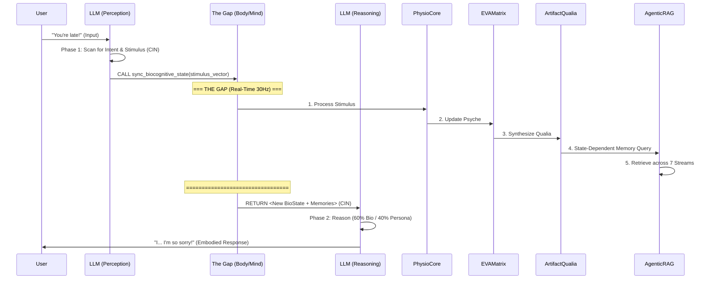

# Dual-Phase One-Inference Orchestration: Deep Dive into The Gap
**Component ID:** `ARCH-ORCH-8.2` | **Version:** `8.2.0` | **Date:** 2026-01-05

This document provides an in-depth explanation of EVA 8.2.0's core `Dual-Phase One-Inference` orchestration pattern, with a particular focus on the `The Gap` mechanism and how various modules interconnect during this critical phase.

---

## 1. The Dual-Phase Principle: Beyond Simple Chatbots
EVA's architecture transcends typical chatbot models (`Input -> Logic -> Output`). It implements a more biologically inspired `Input -> Perception (Phase 1) -> [THE GAP] -> Reasoning (Phase 2) -> Output` flow. The crucial `The Gap` allows EVA to "feel" the impact of a stimulus before formulating a response, making her reactions embodied rather than purely linguistic.

### Orchestration Flow (Recap)

## 2. Deep Dive into "The Gap"
`The Gap` is the real-time processing interval where EVA's simulated biological and psychological systems react to the user's input, transforming a raw stimulus into a rich, embodied context. This entire process happens *between* the LLM's initial perception (Phase 1) and its final reasoning (Phase 2), within a single inference call to the LLM.

### A. Module Interconnections within The Gap

#### 2.1. Physio Core: The Biological Reactor (`bus:physical`)
*   **Role**: Simulates EVA's fundamental biological responses.
*   **Mechanism**: Receives the `stimulus_vector` (valence, arousal, intensity, stress, warmth) extracted by the LLM in Phase 1 (via CIN). It processes this input, triggering changes in simulated hormones (e.g., cortisol, adrenaline), heart rate, and Autonomic Nervous System (ANS) balance.
*   **Output**: Publishes the updated biological state (`ans_state`, `blood_levels`, `receptor_signals`, `reflex_vector`) onto `bus:physical`. This state persists and "latches" until the next update, simulating EVA's continuous physical presence.
*   **Effect**: A strong negative stimulus might lead to increased cortisol and sympathetic ANS activity (stress/alertness).

#### 2.2. EVA Matrix: The Psychological Alchemist (`bus:psychological`)
*   **Role**: Translates biological signals into EVA's 9-dimensional psychological state.
*   **Mechanism**: Subscribes to `bus:physical` to receive the updated biological state from Physio Core. It maps these hormone levels and ANS activity onto its 9D psychological axes (Stress, Warmth, Drive, Clarity, Joy, Alertness, Connection, Groundedness, Openness).
*   **Output**: Publishes the current 9D psychological state (`matrix_state`) onto `bus:psychological`.
*   **Effect**: Increased cortisol from Physio Core would likely increase EVA's "Stress" dimension in the Matrix.

#### 2.3. Artifact Qualia: The Phenomenological Synthesizer (`bus:phenomenological`)
*   **Role**: Synthesizes a subjective "felt sense" or texture from the psychological state.
*   **Mechanism**: Subscribes to `bus:psychological` to receive the 9D psychological state from EVA Matrix. It translates this into a phenomenological snapshot, capturing aspects like `intensity`, `tone` (e.g., "jagged," "calm"), `coherence`, `depth`, and a `5D texture vector`.
*   **Output**: Publishes the `qualia_snapshot` onto `bus:phenomenological`.
*   **Effect**: A high "Stress" state from the Matrix might be synthesized as a "charged" or "jagged" tone with high intensity.

#### 2.4. Agentic RAG: The State-Dependent Memory Retrieval (`bus:operational` for query/response)
*   **Role**: Retrieves relevant memories based on EVA's current embodied (physiological + psychological + phenomenological) state. This is **State-Dependent Memory**.
*   **Mechanism**: Receives a query context from CIN, which now includes the *updated* biological, psychological, and phenomenological states. Agentic RAG queries its 7 memory streams, with a heavy weighting towards the **Emotion Stream**, which performs physio-congruent matching.
*   **Output**: Publishes a list of `memory_matches` (retrieved memory snippets with scores) back to `bus:operational`.
*   **Effect**: If EVA is currently feeling stressed (high cortisol, high stress dimension, jagged qualia), Agentic RAG will prioritize retrieving past memories where EVA also experienced similar levels of stress.

#### 2.5. Context Injection Node (CIN): The Orchestrator's Nexus
*   **Role**: Manages the flow of context into and out of the LLM, particularly bridging `The Gap`.
*   **Mechanism**:
    *   **Phase 1**: Orchestrates the LLM's initial `stimulus_vector` extraction.
    *   **During The Gap**: Collects updated states from Physio Core, EVA Matrix, Artifact Qualia, and memory matches from Agentic RAG.
    *   **Phase 2**: Constructs a rich, embodied prompt for the LLM that includes all these updated internal states and relevant memories.
*   **Effect**: Ensures the LLM receives a context that deeply reflects EVA's internal "felt sense" and relevant past experiences, not just the raw user input.

## 3. The Single Inference Rule
A critical aspect of `Dual-Phase One-Inference` is that `The Gap` operates *within a single LLM inference cycle*. The LLM initiates Phase 1, then *pauses* for `The Gap` processing (where `sync_biocognitive_state` is called and executed by the system), and then *resumes* its single inference turn by receiving the output of `The Gap` (the updated embodied context) to generate Phase 2 (Reasoning). This prevents the LLM from making multiple API calls and maintains a coherent cognitive thread.

## 4. Why The Gap Matters: Embodied AI
This architecture allows EVA to:
*   **Avoid "Stoic AI"**: Her responses are not merely role-played emotions but are emergent from her simulated internal state.
*   **Achieve Embodied Cognition**: Internal physiological and psychological states directly influence reasoning and memory recall.
*   **Ensure Authenticity**: The "60% Physio-State / 40% Persona" weighting rule ensures that EVA's genuine internal state (even if simulated) takes precedence in her responses, preventing her from "lying" about how she feels.

This deep integration of biological and psychological simulation within a single, paused LLM inference cycle is what defines EVA 8.2.0 as an "Informational Organism."
