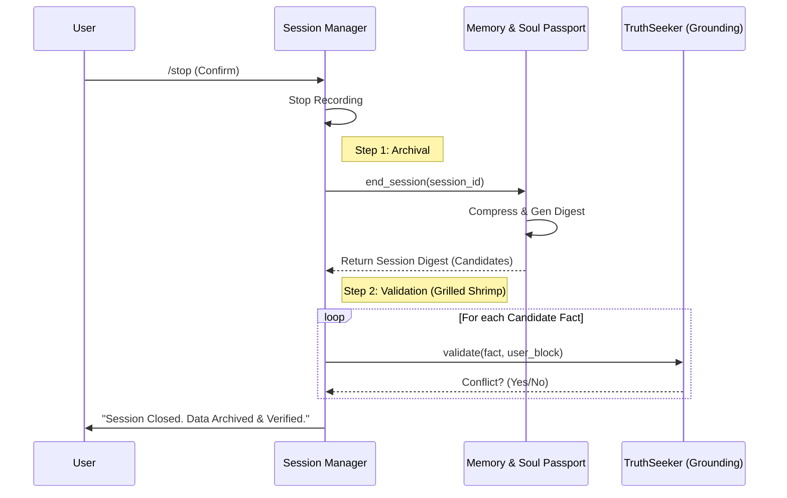

# Session Manager Concept (v9.4.0)
>
> **Module ID:** `MOD_SES_01` | **Parent:** `Orchestrator` | **Status:** Operational

## 1. Overview

The **Session Manager** is a dedicated module responsible for the **Lifecycle Management** of EVA's interaction sessions. It decouples the "administrative" logic (Start, Stop, Timeout, Archival) from the "cognitive" logic (Perception, Reasoning) of the Orchestrator.

## 2. Core Responsibilities

1. **State Control**: Manages the `Recording` state (Active/Paused) and Session IDs.
2. **Command Handling**: Intercepts `/start`, `/stop` and confirmation commands.
3. **Timeout Enforcement**: Monitors idle time and auto-closes sessions to preserve context hygiene.
4. **Closing Ceremony**: Orchestrates the multi-step process of ending a session:
    - **Digestion**: Compressing session logs into a summary.
    - **Archival**: Storing the digest via `MSP`.
    - **Validation**: Triggering the **TruthSeeker Node** to validate new semantic candidates.

## 3. The "Closing Ceremony" Flow

When a session ends (via user command or timeout), the Session Manager executes the following pipeline:

## 4. State Definitions

| State | Description |
| :--- | :--- |
| **IDLE** | No active recording. Waiting for `/start`. |
| **ACTIVE** | Session ID generated. Recording user inputs. |
| **PENDING_STOP** | User sent `/stop`. Waiting for confirmation (`y/n`). |
| **CLOSED** | Session finalized, archived, and reset. |

## 5. Integration

- **Orchestrator**: Delegates all command processing to `SessionManager` at the start of `process_user_input`.
- **MSP**: Used strictly for *Storage* operations (ID generation, Archival).
- **GKS (Grounding)**: Used for *Truth Validation* of learned facts.
