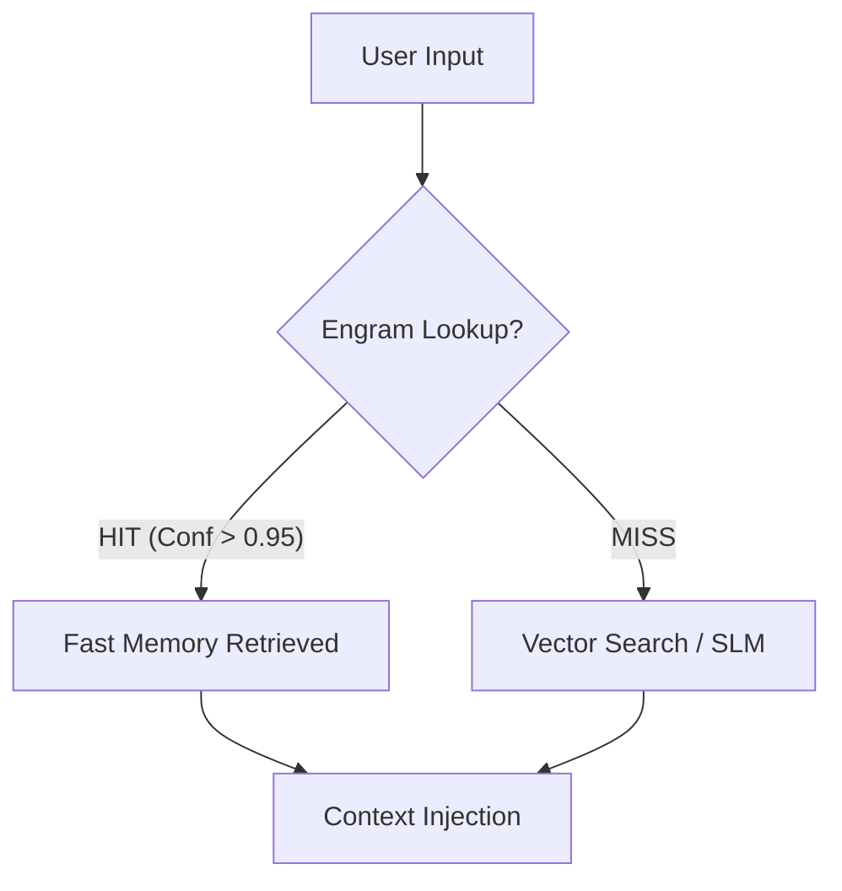

# Conditional Memory (Engram System) – Concept & Architecture

> **Status**: Active (v1.0)
> **Type**: System Module (Memory & Persistence Layer)
> **Inspiration**: DeepSeek Conditional Memory (Scalable Lookup)

---

## 1. Core Philosophy: "Don't Think to Remember"

Traditional LLM pipelines waste compute processing the same inputs repeatedly (e.g., greetings, standard commands, FAQ). The **Engram System** introduces a "Reflexive Layer" inspired by biological engrams—physical traces of memory that fire instantly.

**The Goal**: Achieve **O(1) Latency** for high-confidence, repetitive interactions, bypassing the heavy lifting of Vector Search (O(log n)) and LLM Inference (O(n)).

---

## 2. Architecture: The "Fast Path"

The Engram System sits at the very beginning of the **Perception Phase (Step 1)** in the Orchestrator.

### Key Components

1. **EngramEngine**: The logic core. Handles input normalization, SHA-256 caching, and lookup.
2. **EngramStore**: A lightweight, persistent Key-Value store (currently JSON, scalable to Redis).
3. **Confidence Gate**: Logic that dictates *only* high-confidence interactions (`> 0.95`) are committed to Engram storage.

---

## 3. Workflow: Memorization & Retrieval

### A. Lookup (Read)

1. **Normalize**: Input is stripped of minor noise (case, whitespace).
2. **Hash**: Converted to a deterministic SHA-256 hash.
3. **Query**: Checked against `engram_store`.
    - **Hit**: Returns specific metadata + cached response/intent immediately.
    - **Miss**: Pipeline proceeds to standard processing.

### B. Memorization (Write)

1. **Validation**: After a turn, if the AI's confidence score exceeds the **Epistemic Threshold (0.95)**.
2. **Commit**: The input pattern and its successful resolution (Intent, Response) are written to the store.
3. **Reinforcement**: Future hits reinforce the entry (Hit Count ++).

---

## 4. Integration with Validated Systems

- **MSP (Memory Soul Passport)**: Engram acts as a "Hot Cache" sitting in front of the deeper Episodic/Semantic memory managed by MSP.
- **Orchestrator**: Currently integrated directly into the `process_user_input` flow.

---

## 5. Future Roadmap

- [ ] **N-Gram Fuzziness**: Support near-matches (Levenshtein distance) for inputs with tyrpos.
- [ ] **LRU Eviction**: Auto-archive unused engrams to MSP Cold Storage.
