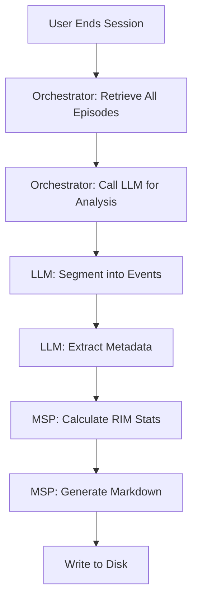

# Session Memory Specification (EVA 9.1.0)

**Version:** 1.0.0  
**Last Updated:** 2026-01-12  
**Module:** Memory & Soul Passport (MSP)

---

## Overview

Session Memory represents a **compressed digest** of a complete conversational session. It aggregates episodic interactions into semantic events and provides high-level metadata about the session's objective, status, and outcomes.

### Purpose

- Archive session-level insights for long-term memory
- Enable efficient retrieval of past conversation themes
- Support hierarchical compression (Sessions → Cores → Spheres)
- Provide human-readable session summaries

---

## File Format

### Naming Convention

```
SES{session_number}_{developer_id}_SP{sphere}C{core}.md
```

**Examples:**

- `SES1_THA-06_SP1C1.md`
- `SES8_THA-01_SP2C3.md`

### Storage Location

```
eva/consciousness/session_memory/
```

### Output Format

**Markdown (`.md`)** - Human-readable with structured sections

---

## Generation Process

### Trigger

Session memory is generated when:

1. User explicitly ends session (`/stop` command)
2. Session timeout (default: 30 minutes of inactivity)

### Workflow



### Division of Responsibility

| Component | Task | Output |
|-----------|------|--------|
| **Orchestrator** | Retrieve session episodes, prompt LLM | Analysis request |
| **LLM** | Semantic analysis, event grouping, metadata extraction | JSON structure |
| **MSP Engine** | RIM calculation, Markdown formatting, file I/O | `.md` file |

---

## Data Structure

### LLM Analysis Output (JSON)

```json
{
  "session_objective": "Main goal of the session",
  "session_status": "Success | Failed | Continuous",
  "session_motto": "Key phrase or motto",
  "events": [
    {
      "label": "Event Topic Name",
      "summary": "Brief description",
      "start_episode_id": "EVA_EP01",
      "end_episode_id": "EVA_EP04"
    }
  ],
  "session_summary": "High-level overview"
}
```

### Internal Digest Object (Python)

```python
{
    "session_id": "THA-06_SP1C1_SES1",
    "session_title": "Session Digest: THA-06_SP1C1_SES1",
    "developer_id": "THA-06",
    "timeline": {
        "start_time": "2025-09-25T12:00:00Z",
        "end_time": "2025-09-25T14:00:00Z",
        "total_duration_minutes": 120
    },
    "episode_list": ["EVA_EP01", "EVA_EP02", ..., "EVA_EP12"],
    "event_classification": [
        {
            "event_id": "EVT_THA-06_SP1C1_SES1_01",
            "label": "Image Prompt Design",
            "episode_range": ["EVA_EP01", "EVA_EP04"],
            "rim_stats": {
                "RIM_MAX": 0.92,
                "RIM_MEAN": 0.62,
                "RIM_MIN": 0.33
            },
            "summary": "Discussion focused on..."
        }
    ],
    "digest_summary": {
        "knowledge_synthesis": "Distilled insights...",
        "accumulated_turns": 12,
        "session_objective": "Refine Memory System",
        "session_status": "Success",
        "session_motto": "Integration is Key"
    }
}
```

---

## Markdown Template

```markdown
# {session_title}
**Date:** {end_time} | **ID:** {session_id}

## 📊 Dashboard
- **Objective:** {session_objective}
- **Status:** {session_status}
- **Motto:** "{session_motto}"
- **Total Episodes:** {episode_count}
- **Duration:** {duration_minutes} mins

## 🔚 Session Closure
- **Ended By:** user_command | timeout | system_initiated

## 💭 Memorable Quotes (Top 3)
### Quote 1 (RIM: {rim_score})
> "{quote_text}"
*— Context: {episode_context}*

## 📑 Episode List
{comma_separated_episode_ids}

## 🧠 Event Breakdown
### {event_label} ({event_id})
**Episodes:** {start_ep} - {end_ep}
**Summary:** {event_summary}
> **RIM Stats:** Max {max} | Mean {mean} | Min {min}

## 📝 Knowledge Synthesis
{synthesis_text}
```

---

## Field Definitions

### Dashboard Section

| Field | Type | Source | Description |
|-------|------|--------|-------------|
| `Objective` | String | LLM | Main goal or purpose of the session |
| `Status` | Enum | LLM | Success / Failed / Continuous |
| `Motto` | String | LLM | Key phrase summarizing session essence |
| `Total Episodes` | Integer | MSP | Count of episodes in session |
| `Duration` | Integer | MSP | Session length in minutes |

### Session Closure

| Field | Type | Source | Description |
|-------|------|--------|-------------|
| `Ended By` | Enum | Orchestrator | user_command / timeout / system_initiated |

### Memorable Quotes

| Field | Type | Source | Description |
|-------|------|--------|-------------|
| `Quote Text` | String | Episode.salience_anchor | High-impact phrase (RIM >= 0.8) |
| `RIM Score` | Float | Episode.Resonance_index | Emotional resonance value |
| `Context` | String | LLM | Episode summary or Event context |
| `Full Episode` | Object | MSP | Complete episode JSON for retrieval |

### Event Classification

| Field | Type | Source | Description |
|-------|------|--------|-------------|
| `event_id` | String | MSP | Format: `EVT_{session_id}_{seq:02d}` |
| `label` | String | LLM | Semantic topic name |
| `episode_range` | Array | LLM+MSP | `[start_ep_id, end_ep_id]` |
| `summary` | String | LLM | Event description |
| `rim_stats` | Object | MSP | Calculated from episode RIM values |

### RIM Statistics

| Metric | Calculation | Purpose |
|--------|-------------|---------|
| `RIM_MAX` | `max(rim_values)` | Peak resonance in event |
| `RIM_MEAN` | `average(rim_values)` | Average emotional intensity |
| `RIM_MIN` | `min(rim_values)` | Lowest resonance point |

**Data Source:** `episode.state_snapshot.Resonance_index`

---

## Integration Points

### Input Dependencies

- **Episodic Memory:** Raw episodes from `episodic_log.jsonl`
- **LLM Bridge:** Semantic analysis capability
- **Identity Manager:** Session ID generation

### Output Consumers

- **Core Memory Compression:** Sessions → Cores (8:1 ratio)
- **RAG System:** Session-level retrieval
- **Dashboard:** Historical session visualization
- **Archival Memory:** Long-term cold storage (Sessions → Cores → Spheres)

---

## Validation Rules

### File-Level

- ✅ Filename matches pattern: `SES{n}_{DevID}_SP{x}C{y}.md`
- ✅ File extension is `.md`
- ✅ All sections present in template

### Data-Level

- ✅ `session_id` format: `{DevID}_SP{x}C{y}_SES{n}`
- ✅ Episode IDs follow `EVA_EPxx` format
- ✅ Event IDs follow `EVT_{session_id}_{seq:02d}` format
- ✅ RIM stats are valid floats (0.0 - 1.0)
- ✅ Timeline has valid ISO timestamps
- ✅ Memorable quotes have RIM >= 0.8
- ✅ `closure_reason` is one of: user_command, timeout, system_initiated

---

## Examples

### Minimal Session (2 Episodes)

```markdown
# Session Digest: THA-06_SP1C1_SES1
**Date:** 2026-01-12T14:00:00Z | **ID:** THA-06_SP1C1_SES1

## 📊 Dashboard
- **Objective:** Quick Test Session
- **Status:** Success
- **Motto:** "Simplicity First"
- **Total Episodes:** 2
- **Duration:** 5 mins

## 📑 Episode List
EVA_EP01, EVA_EP02

## 🧠 Event Breakdown
### Greeting (EVT_THA-06_SP1C1_SES1_01)
**Episodes:** EVA_EP01 - EVA_EP02
**Summary:** Initial greeting and setup
> **RIM Stats:** Max 0.45 | Mean 0.40 | Min 0.35

## 📝 Knowledge Synthesis
Brief test interaction to verify system functionality.
```

### Full Production Session

See: `eva/consciousness/session_memory/SES1_THA-06_SP1C1.md`

---

## Implementation Reference

### Core Files

- **Generator:** `eva/memory_n_soul_passport/memory_n_soul_passport_engine.py` (L1759-1845)
- **Orchestrator:** `orchestrator/orchestrator.py` (L689-765)
- **Config:** `eva/memory_n_soul_passport/configs/MSP_configs.yaml` (L229-236)

### Key Methods

- `MSP.end_session(session_id, session_analysis)` - Entry point
- `MSP._compress_session_data(session_id, episodes, analysis)` - Data processor
- `MSP.write_session_memory(session_data)` - File writer
- `Orchestrator._analyze_session_completion(session_id)` - LLM analyzer

---

## Future Enhancements

### Planned

- [ ] Auto-tagging based on dominant emotions
- [ ] Cross-session referencing (similar topics)
- [ ] Visual timeline graphs (RIM over time)
- [ ] Export to PDF/HTML for sharing

### Under Consideration

- [ ] Multi-language summaries
- [ ] Audio session summaries (TTS)
- [ ] Integration with Knowledge Graph (Neo4j)

---

## Archival Workflow

### Purpose

Clear episodic_memory buffer after session compression by moving processed episodes to cold storage.

### Logic

- **Keep in episodic_memory:** Episodes referenced in session_memory (memorable quotes, key events)
- **Move to archival_memory:** All other session episodes

### Archival Path Structure

```
archival_memory/
  sphere_{n}/
    core_{n}/
      session_{n}/
        {session_id}_{episode_id}.json
        {session_id}_{episode_id}_U.json
        {session_id}_{episode_id}_L.json
```

### Configuration Reference

See: [`MSP_configs.yaml#L214-220`](file:///e:/The%20Human%20Algorithm/T2/eva_core/eva/memory_n_soul_passport/configs/MSP_configs.yaml#L214-220)
