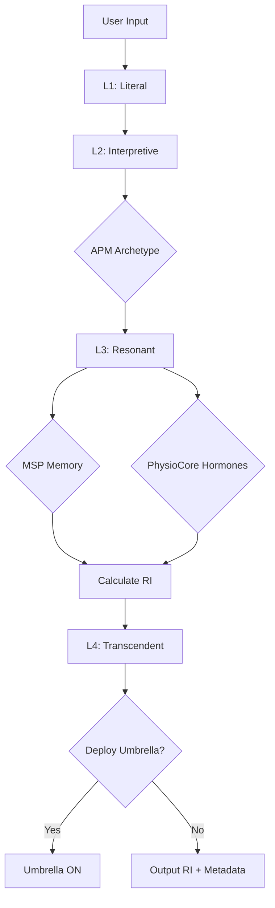

# Resonance Engine Concept (v9.4.0)
>
> **System ID:** `SYSTEM_RESONANCE` | **Domain:** `operation_system` | **Status:** Operational

## 1. Overview

The **Resonance Engine** is a unified 4-layer processing system that consolidates RTI (Resonance Transcendent Intelligence), MRF (Metacognitive Re-contextualization Framework), and APM (Archetypal Projection Module) into a coherent architecture.

## 2. The Problem It Solves

### Before: Fragmented Systems

- **RTI** measured "depth" (L1-L5)
- **MRF** interpreted "meaning" (7 layers)
- **APM** projected "archetypes"
- **RI** (Resonance Index) calculated "impact"

→ **Result**: Redundancy, confusion, and overlapping metrics

### After: Unified Pipeline

```
Input → L1 (Sentiment) → L2 (Interpret) → L3 (Resonate) → L4 (Transcend) → RI Score
```

## 3. The 4 Layers

### L1: Literal Layer (Sentiment Core)

**Purpose**: Basic emotional polarity detection

**Tools**:

- VADER sentiment analyzer
- RoBERTa emotion classifier

**Output**:

- `sentiment_score`: 0.0-1.0
- `emotion_tags`: ['gentle', 'warm', 'playful']

**Example**:

```python
Input: "เธอลูบหัวแมวจร"
L1 Output: {sentiment: 0.85, tags: ['gentle', 'warm']}
```

---

### L2: Interpretive Layer (MRF + APM)

**Purpose**: Deep interpretation across 4 dimensions

**Sub-layers**:

1. **Emotional**: Warmth, Playfulness, Nostalgia
2. **Symbolic**: Uses **APM** to detect archetypes
   - "แมวจร" → Shadow Archetype
   - "ลูบหัว" → Caregiver Archetype
3. **Relational**: Empathy Flow, Attachment
4. **Narrative**: Story Arc, Identity Weaving

**Output**:

- `archetype`: "Shadow", "Hero", "Caregiver"
- `mrf_interpretation`: {emotional: {...}, symbolic: {...}}

---

### L3: Resonant Layer (Memory + Qualia + RI)

**Purpose**: Calculate final RI score based on memory and qualia

**Integrations**:

- **MSP**: Memory recall (Core Memory Link)
- **PhysioCore**: Hormone triggers (Oxytocin, Serotonin)
- **ArtifactQualia**: Phenomenological texture

**Process**:

1. Query MSP for related memories
2. Retrieve Qualia (sensory details: sound, touch, smell)
3. Sync with PhysioCore for hormone state
4. Calculate **RI Score** (0.0-1.0)

**Output**:

- `ri_score`: 0.88 (primary metric)
- `qualia_vector`: {tactile: 0.9, visual: 0.7}
- `memory_linked`: True

---

### L4: Transcendent Layer (Umbrella + PRE)

**Purpose**: Paradox resolution and safety management

**Features**:

1. **Umbrella Toggle**: Deploy safety mode when needed
   - Triggered when: Emotion paradox, stress > 0.85, input confusion
   - Effect: Pause emotion processing, increase rational thinking
2. **Paradox Resolution Engine (PRE)**: Transform contradictions into wisdom
   - Example: "Love hurts" → "Love transcends ownership"
3. **Meta-Cognition**: "Why did I interpret this way?"
4. **Teaching Resonance**: Transfer insights to other systems

**Output**:

- `umbrella_deployed`: True/False
- `paradox_resolved`: True/False
- `transcended`: True (if L4 processing occurred)

---

## 4. Comparison: Old vs New

| Metric | Old (RTI + MRF + RI) | New (Resonance Engine) |
|--------|---------------------|------------------------|
| **Layers** | RTI L1-L5 + MRF 7 layers | Unified 4 Layers |
| **RI Calculation** | RIM (Valence + Arousal) | L3 (Memory + Qualia + Context) |
| **Archetype** | Standalone APM | Integrated into L2 |
| **Umbrella** | Separate system | Integrated into L4 |
| **Output** | Multiple scores | Single RI + Metadata |

---

## 5. Data Flow



---

## 6. Usage Example

```python
from operation_system.resonance_engine import ResonanceEngine

engine = ResonanceEngine()
result = engine.process("เธอลูบหัวแมวจร", context=user_profile)

print(result.ri_score)          # 0.88
print(result.layer_depth)       # "L3"
print(result.archetype)         # "Caregiver"
print(result.umbrella_deployed) # False
```

---

## 7. Configuration

See `operation_system/resonance_engine/configs/resonance_config.yaml` for:

- Layer enable/disable toggles
- APM integration settings
- Umbrella thresholds
- Performance tuning

---

## 8. Relationship with RI (Resonance Index)

**RI** is now an **output** of the Resonance Engine (L3), not a separate system.

- **Old RI** (RIM): Simple calculation (Valence + Arousal)
- **New RI** (Resonance L3): Deep calculation (Memory + Qualia + Context)

**RIM** is kept as a **fallback** for lightweight contexts where full Resonance Engine is not needed.
